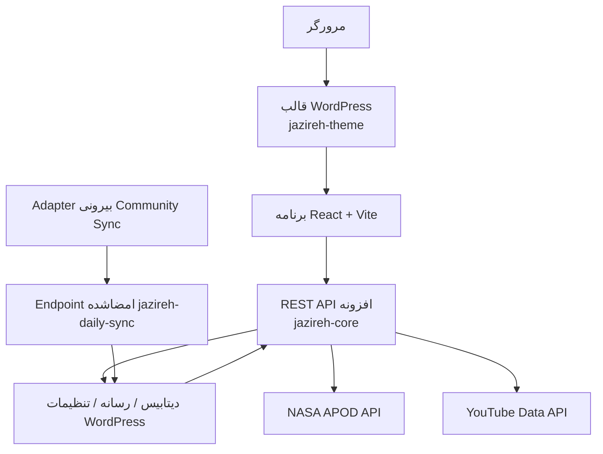

<p align="center">
  
</p>

<h1 align="center">جزیره نجوم</h1>

<p align="center">
  پرتال فارسی و راست‌چین نجوم که محتوای علمی، رسانه جزیره، و تجربه‌های داده‌محور تکرارشونده را در یک محصول واحد جمع می‌کند.
</p>

<p align="center">
  <strong>وضعیت:</strong> در حال توسعه / پیش از استقرار نهایی
</p>

<p align="center">
  React · Vite · WordPress · REST API سفارشی · NASA APOD · YouTube Data API
</p>

<p align="center">
  <a href="./README.md">English README</a> ·
  <a href="https://www.youtube.com/@Jazireh">کانال یوتیوب</a> ·
  <a href="./docs/ARCHITECTURE.md">معماری</a> ·
  <a href="./docs/API.md">API</a> ·
  <a href="./docs/ROADMAP.md">نقشه راه</a> ·
  <a href="./docs/PRODUCT_VISION.md">چشم‌انداز محصول</a>
</p>

> [!IMPORTANT]
> این ریپازیتوری عمومی و Source-available است و برای بررسی فنی و نمایش نمونه‌کار منتشر شده است. متن آن Open Source نیست و استفاده، استقرار، بازنشر یا ساخت مشتق بدون مجوز کتبی مجاز نیست. جزئیات در [LICENSE](./LICENSE) آمده است.

## معرفی

جزیره قرار نیست فقط یک وبلاگ نجومی باشد. جهت‌گیری محصول، ساخت یک پرتال علمی فارسی است؛ جایی که محتوای تحلیلی، ویدیو، و داده‌های علمی تکرارشونده کنار هم قرار می‌گیرند و کاربر را به بازگشت دوباره تشویق می‌کنند.

نسخه فعلی ریپازیتوری همین مسیر را نشان می‌دهد:

- فرانت‌اند React + Vite
- قالب سفارشی WordPress برای ارائه شل برنامه
- افزونه `jazireh-core` به عنوان بک‌اند اصلی محصول
- WordPress به عنوان مرجع مدیریت محتوا، تنظیمات، رسانه و ادمین
- یکپارچه‌سازی سروری با NASA APOD و YouTube
- مسیر همگام‌سازی بیرونی برای Jazireh Daily و پست‌های Community

## پیش‌نمایش

| خانه دسکتاپ | خانه موبایل |
|---|---|
|  |  |

| جزیره دیلی |
|---|
|  |

## نکات مهندسی مهم

- **ترکیب React و WordPress در یک معماری واحد.** WordPress مالک محتوا، تنظیمات، رسانه، ادمین و احراز هویت است و React تجربه عمومی SPA را ارائه می‌کند.
- **ایزوله‌سازی کلیدها و سرویس‌های بیرونی در سمت سرور.** مرورگر فقط با REST وردپرس حرف می‌زند و کلیدهای NASA و YouTube به فرانت‌اند نمی‌رسند.
- **یکپارچه‌سازی قابل اتکای ویدیوهای جدید.** واکشی ویدیوها با مسیر رسمی uploads playlist انجام می‌شود و Shorts و استریم‌های live/upcoming از خروجی عمومی حذف می‌شوند.
- **ورود امن Jazireh Daily.** همگام‌سازی Community از طریق یک Adapter بیرونی به Endpoint امضاشده وردپرس می‌رسد و با HMAC، محدودیت زمانی و replay protection محافظت می‌شود.
- **پایداری محتوای Community بعد از همگام‌سازی.** متن و تصویرها داخل WordPress ذخیره می‌شوند تا سایت به مارکاپ ناپایدار بالادست وابسته نماند.
- **توجه به عملکرد فرانت‌اند.** Lazy loading مسیرها، motion سبک مبتنی بر CSS، رسانه‌های واکنش‌گرا و کاهش وابستگی‌ها بخشی از کارهای انجام‌شده‌اند.

## قابلیت‌های فعلی

ویژگی‌های موجود و فعال در ریپازیتوری فعلی:

- خانه
- آرشیو اخبار
- جزئیات خبر
- ویدیوها
- NASA APOD
- آسمان
- کاوش
- رادار
- آرشیو جزیره دیلی
- جزئیات پست‌های جزیره دیلی
- ثبت‌نام خبرنامه
- مدیریت بومی WordPress

## وضعیت ویژگی‌ها

| بخش | وضعیت | توضیح |
|---|---|---|
| صفحه اصلی | پیاده‌سازی شده | React از طریق قالب WordPress ارائه می‌شود |
| اخبار علمی | پیاده‌سازی شده | مدل محتوایی وردپرس + REST + صفحه جزئیات |
| آخرین ویدیوهای یوتیوب | پیاده‌سازی شده | YouTube Data API سمت سرور با کش |
| NASA APOD | پیاده‌سازی شده | واکشی سروری با بازه تاریخ پویا و transient |
| Jazireh Daily | پیاده‌سازی شده | Adapter بیرونی + ورودی امضاشده + ذخیره در WordPress |
| خبرنامه | پیاده‌سازی شده | ذخیره‌سازی مشترکان در وردپرس |
| Explore / اجرام | پیاده‌سازی شده | داده محتوایی آموزشی تالیفی |
| Sky | جزئی | خروجی فعلی یک snapshot سازگار و ثابت است |
| Radar | جزئی | شبیه‌سازی است، نه رهگیری زنده |
| جستجو | برنامه‌ریزی‌شده | در کد فعلی به‌صورت قابلیت عمومی فعال وجود ندارد |
| Sun Now / خورشید زنده | برنامه‌ریزی‌شده | در runtime فعلی وجود ندارد |
| EPIC زمین | برنامه‌ریزی‌شده | در runtime فعلی وجود ندارد |
| زلزله‌ها | برنامه‌ریزی‌شده | در runtime فعلی وجود ندارد |
| رویدادهای نجومی | برنامه‌ریزی‌شده | در runtime فعلی وجود ندارد |
| Topic hubs | برنامه‌ریزی‌شده | در runtime فعلی وجود ندارد |
| حساب کاربری عمومی | برنامه‌ریزی‌شده | تجربه حساب کاربری سفارشی هنوز فعال نیست |
| PWA | برنامه‌ریزی‌شده | آیکن‌ها موجودند اما قابلیت کامل PWA تحویل نشده است |
| نسخه انگلیسی | برنامه‌ریزی‌شده | نسخه دوزبانه فعال در runtime وجود ندارد |

## معماری فعلی



بک‌اند مستقل قدیمی دیگر بخشی از معماری فعال runtime نیست.

جزئیات کامل‌تر در [docs/ARCHITECTURE.md](./docs/ARCHITECTURE.md) آمده است.

## پایداری، عملکرد، امنیت

**پایداری**

- استفاده از transient برای APOD و ویدیوها
- نگه‌داشت last-known-good برای ویدیوهای یوتیوب
- جلوگیری از تکرار در Jazireh Daily با شناسه منبع و هش محتوا
- امکان مدیریت و اصلاح دستی محتوا در WordPress حتی هنگام اختلال در sync

**عملکرد**

- lazy loading در سطح route
- مدیریت واکنش‌گرای رسانه‌ها
- کاهش وزن جاوااسکریپت بعد از حذف وابستگی‌های سنگین‌تر از سطح عمومی
- نگه‌داشت build قالب داخل ریپازیتوری برای استقرار قابل پیش‌بینی

**امنیت**

- کلیدهای NASA و YouTube فقط سمت سرور هستند
- احراز هویت WordPress مرجع اصلی است
- ورود Jazireh Daily با HMAC محافظت می‌شود
- درخواست sync با timestamp و replay protection بررسی می‌شود
- فرانت‌اند عمومی هیچ secret واقعی را حمل نمی‌کند

## ساختار ریپازیتوری

```text
./
├── .github/                           تنظیمات و workflowهای GitHub
├── docs/                              مستندات عمومی فنی
├── frontend/                          سورس React + Vite
├── tools/community-sync/              ابزارهای بیرونی همگام‌سازی جزیره دیلی
├── wordpress/
│   └── wp-content/
│       ├── plugins/jazireh-core/      افزونه سفارشی: REST، محتوا، تنظیمات، یکپارچه‌سازی
│       └── themes/jazireh-theme/      قالب سفارشی و assetهای build
├── CHANGELOG.md
├── CONTRIBUTING.md
├── LICENSE
├── README.fa.md
├── README.md
├── SECURITY.md
└── START-HERE-FA.md
```

در این ریپازیتوری فقط کدهای متعلق به پروژه قرار گرفته‌اند. WordPress core، دیتابیس زنده و uploads محیط اجرا، عمدا داخل GitHub نگهداری نمی‌شوند.

## توسعه محلی

مثال‌های این بخش فقط الگوی محیط محلی فعلی نویسنده را نشان می‌دهند و معماری تولید نیستند.

### پیش‌نیازها

- Node.js 20+
- npm 10+
- PHP 7.4+
- MySQL
- یک محیط محلی WordPress مانند XAMPP، Local یا Laragon

### ساخت فرانت‌اند

از داخل [`frontend/`](./frontend/):

```bash
npm ci
npm run build
npm run build:wordpress
```

خروجی build قالب در این مسیر نوشته می‌شود:

```text
wordpress/wp-content/themes/jazireh-theme/dist
```

### الگوی runtime محلی

در دستگاه فعلی نویسنده، سورس پروژه از runtime فعال WordPress جدا است. به همین دلیل ریپازیتوری فقط قالب و افزونه سفارشی را نگه می‌دارد.

نمونه مسیر runtime محلی:

```text
C:\xampp\htdocs\wordpress
```

نمونه REST base محلی:

```text
http://localhost/wordpress/wp-json/jazireh/v1
```

## الگوی استقرار

برای استقرار staging یا production این موارد لازم هستند:

- WordPress core/runtime
- دیتابیس محتوای جزیره
- `wp-content/uploads`
- `jazireh-theme`
- `jazireh-core`
- تنظیمات و secretهای محیط تولید
- HTTPS
- یک worker زمان‌بندی‌شده بیرونی برای sync خودکار Jazireh Daily

این ریپازیتوری نباید همراه با `frontend/node_modules`، cacheهای محلی یا فایل‌های مخصوص XAMPP مستقیما روی هاست کپی شود.

## محدودیت‌های فعلی

- Sky فعلا یک snapshot ثابت و سازگار ارائه می‌کند و فید زنده وضعیت آسمان نیست.
- Radar یک تجربه شبیه‌سازی‌شده است و رهگیری علمی زنده انجام نمی‌دهد.
- Explore بر پایه محتوای آموزشی curated ساخته شده، نه کاتالوگ زنده نجومی.
- نمایش Jazireh Daily آماده است، اما ورود خودکار پست‌های جدید Community به Adapter بیرونی و پایداری استخراج از YouTube وابسته است.
- پروژه هنوز در وضعیت پیش از استقرار نهایی قرار دارد و در این README به‌عنوان محصول live نهایی معرفی نمی‌شود.

## انتساب و اعتبار منابع

جزیره یک پروژه مستقل برای مشتری است و وابستگی رسمی به NASA یا YouTube ندارد. تصاویر و APIهای بیرونی باید با انتساب مناسب به منبع اصلی معرفی شوند.

طراحی و توسعه توسط **آرتین کریمی** برای یک پروژه واقعی مشتری انجام شده است.
