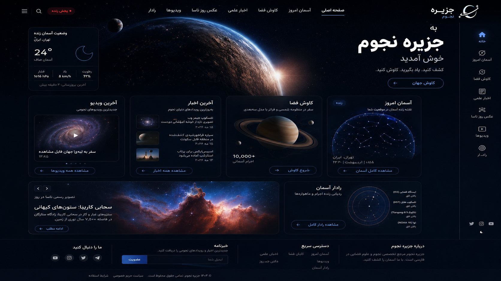

<div align="center">

# جزیره نجوم

**پلتفرم فارسی نجوم و کاوش فضا، ساخته‌شده برای یک مشتری واقعی**

React · Vite · Tailwind CSS · Three.js · PHP · MySQL

[English README](README.md) · [معماری](docs/ARCHITECTURE.md) · [API](docs/API.md)

</div>

> [!IMPORTANT]
> این ریپازیتوری یک پروژهٔ **Source Available برای نمایش نمونه‌کار** است و Open Source نیست. مشاهدهٔ سورس برای ارزیابی فنی و استخدامی مجاز است؛ اما نصب، اجرا، استقرار، کپی، تغییر، انتشار مجدد، فروش یا استفادهٔ تجاری بدون اجازهٔ کتبی مجاز نیست. متن کامل در فایل [`LICENSE`](LICENSE) قرار دارد.



## معرفی

جزیره نجوم یک وب‌سایت فارسی، راست‌چین و واکنش‌گرا برای محتوای نجومی و کاوش فضا است. پروژه یک رابط تاریک و سینمایی را با تجربه‌های تعاملی، منظومه شمسی سه‌بعدی، اخبار علمی، عکس روز ناسا، ویدیو، رادار شبیه‌سازی‌شده و بک‌اند مدیریت محتوا ترکیب می‌کند.

این پروژه برای یک مشتری واقعی توسعه داده شده و با اجازهٔ او، سورس کامل آن برای نمایش کیفیت فنی در GitHub منتشر می‌شود. عمومی‌بودن ریپو به معنی اجازهٔ استفاده از پروژه نیست.

## امکانات اصلی

- رابط کاملاً فارسی و RTL
- طراحی تاریک، مینیمال و واکنش‌گرا
- تفکیک مسیرها و Lazy Loading در React
- منظومه شمسی سه‌بعدی با React Three Fiber
- نقشه تعاملی صورت‌های فلکی
- رادار تصویری شبیه‌سازی‌شده
- صفحات اخبار، آسمان، APOD، ویدیو و کاوش
- REST API سبک با PHP و PDO
- مسیرهای مدیریت محافظت‌شده با JWT
- دیتابیس MySQL با محتوای نمونه فارسی
- اتصال اختیاری به NASA APOD و OpenWeather
- داده‌های جایگزین محلی برای نمایش پایدار رابط

## وضعیت واقعی بخش‌ها

| بخش | وضعیت |
|---|---|
| رابط فارسی و واکنش‌گرا | پیاده‌سازی شده |
| فهرست عمومی اخبار | متصل به API |
| ورود مدیر | متصل به API؛ بدون اطلاعات ورود عمومی |
| ساخت و حذف خبر در پنل | متصل به API |
| صفحه جزئیات خبر | فعلاً مبتنی بر داده جایگزین محلی |
| API عکس روز، ویدیو، آسمان و اجرام | در بک‌اند پیاده‌سازی شده |
| صفحات عکس روز، ویدیو، آسمان و کاوش | فعلاً از داده محلی استفاده می‌کنند |
| همگام‌سازی NASA و OpenWeather | در بک‌اند پیاده‌سازی شده |
| رادار آسمان | شبیه‌سازی تعاملی، نه رهگیری زنده |
| بررسی خودکار GitHub | اضافه شده |
| تست End-to-End | هنوز اضافه نشده |

## ساختار فنی

```text
مرورگر
  |
  v
React + Vite
  |
  v
PHP REST API
  |  | +--> MySQL
  |
  +----> NASA APOD / OpenWeather
```

جزئیات بیشتر در [`docs/ARCHITECTURE.md`](docs/ARCHITECTURE.md) قرار دارد.

## پاک‌سازی نسخه عمومی

نسخهٔ GitHub از نسخهٔ کاری پروژه جدا شده و این موارد در آن رعایت شده‌اند:

- فایل‌های واقعی `.env` حذف شده‌اند.
- JWT Secret قبلی منتشر نشده است.
- دیتابیس هیچ حساب مدیر فعال و قابل‌استفاده‌ای ندارد.
- فرم ورود شامل ایمیل یا رمز ازپیش‌نوشته‌شده نیست.
- فایل Build تولیدشده در Git نگهداری نمی‌شود.
- Log، Cache و Uploadهای محیط اجرا Ignore شده‌اند.
- بدون JWT Secret امن، توکن ساخته نمی‌شود.

## محدودیت‌های فعلی

- چند صفحه عمومی هنوز به Endpoint متناظر خود متصل نشده‌اند.
- جزئیات خبر هنوز مقاله را با Slug از بک‌اند دریافت نمی‌کند.
- API مدیریت APOD و ویدیو وجود دارد، اما فرم‌های آن در داشبورد کامل نشده‌اند.
- فرم خبرنامه هنوز به بک‌اند وصل نیست.
- داده‌های رادار شبیه‌سازی‌شده‌اند.
- صحنه سه‌بعدی برای تجربه بصری ساخته شده، نه مقیاس و مدار علمی دقیق.

## مالکیت و استفاده

برند، محتوای مشتری، تصاویر، ویدیوها، نوشته‌ها و فایل‌های رسانه‌ای می‌توانند مالکیت و شرایط جداگانه داشته باشند و اجازهٔ استفاده از آن‌ها داده نشده است. کتابخانه‌های شخص ثالث تابع مجوزهای خودشان هستند.

## سازنده

توسعه داده‌شده توسط **Artin Karimi** برای یک پروژهٔ واقعی مشتری.

## مجوز

تمام حقوق محفوظ است. این پروژه Open Source نیست و از مجوز اختصاصی Source Available استفاده می‌کند. قبل از هرگونه تعامل با کد، فایل [`LICENSE`](LICENSE) را بخوانید.
