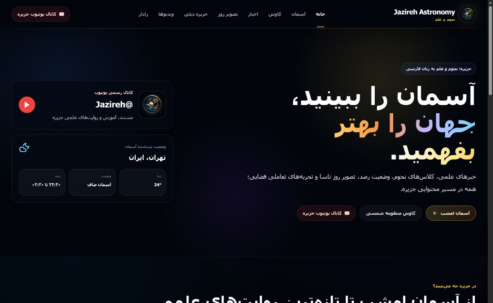
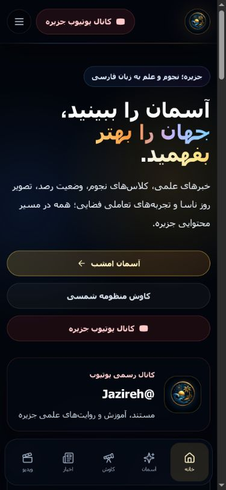
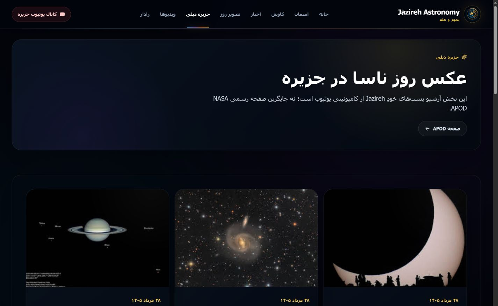
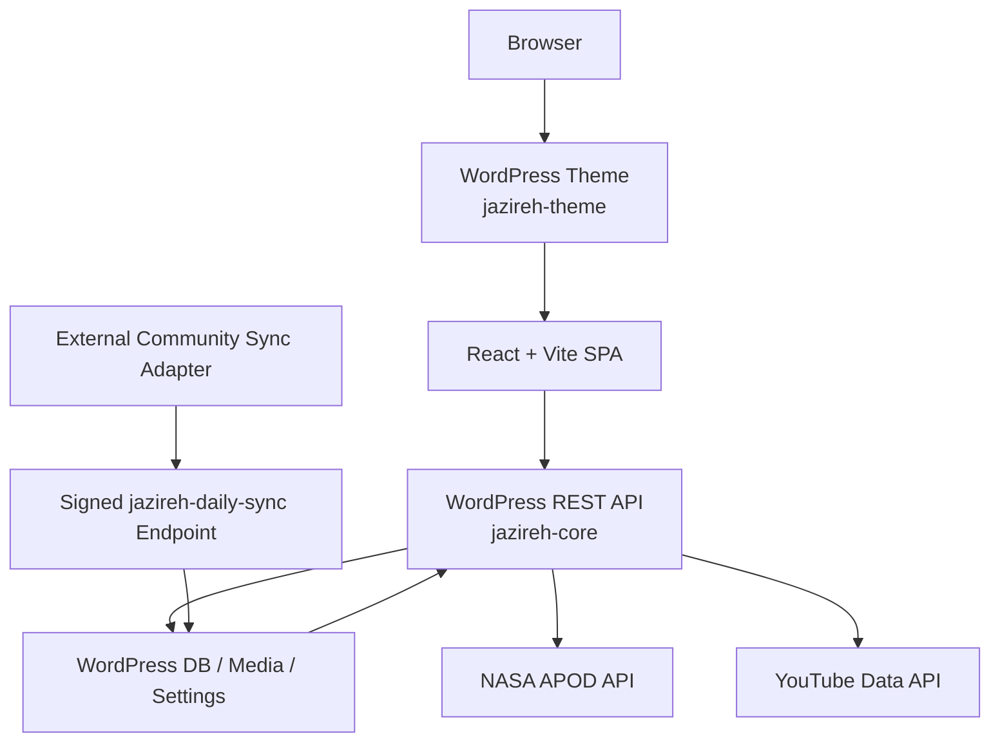

<p align="center">
  
</p>

<h1 align="center">Jazireh Astronomy</h1>

<p align="center">
  Persian RTL astronomy portal combining editorial science content, Jazireh media, and recurring scientific data experiences.
</p>

<p align="center">
  <strong>Status:</strong> Active Development / Pre-production
</p>

<p align="center">
  React · Vite · WordPress · Custom REST API · NASA APOD · YouTube Data API
</p>

<p align="center">
  <a href="./README.fa.md">Persian README</a> ·
  <a href="https://www.youtube.com/@Jazireh">YouTube Channel</a> ·
  <a href="./docs/ARCHITECTURE.md">Architecture</a> ·
  <a href="./docs/API.md">API</a> ·
  <a href="./docs/ROADMAP.md">Roadmap</a> ·
  <a href="./docs/PRODUCT_VISION.md">Product Vision</a>
</p>

> [!IMPORTANT]
> This repository is public and source-available for technical review and portfolio presentation. It is not open source. Use, redistribution, deployment, and derivative work require prior written permission. See [LICENSE](./LICENSE).

## Overview

Jazireh is not positioned as a simple astronomy blog. The product direction is a Persian scientific portal: a place where editorial content, video, and recurring scientific information give visitors a reason to come back.

Today, the public application is already built around that model:

- React + Vite frontend delivered through a custom WordPress theme
- `jazireh-core` WordPress plugin as the application backend
- WordPress as the CMS, admin, media store, and settings authority
- server-side integrations for NASA APOD and YouTube latest videos
- external Jazireh Daily sync pipeline for YouTube Community content

## Visual Preview

| Home Desktop | Home Mobile |
|---|---|
|  |  |

| Jazireh Daily |
|---|
|  |

## Engineering Highlights

- **React inside WordPress, without splitting the product in two.** WordPress owns content, settings, admin, media, and auth; React owns the public SPA experience.
- **Server-side external integrations.** NASA and YouTube API keys stay off the public frontend. The browser talks only to WordPress REST.
- **Reliable latest-video ingestion.** YouTube retrieval uses the channel uploads-playlist flow, filters out Shorts and live/upcoming streams, and keeps a last-known-good cache.
- **Signed Jazireh Daily ingestion.** Community posts are synchronized through an external adapter into a dedicated WordPress endpoint protected by HMAC, timestamp validation, and replay protection.
- **WordPress as the stable publishing surface.** After sync, Community imagery and content live in WordPress posts/media instead of being hot-linked from a fragile upstream source.
- **Performance-conscious frontend work.** Route lazy loading, lightweight CSS motion, responsive media, and a reduced dependency surface keep the public app leaner than the earlier iterations.

## Current Features

Implemented in the current repository and runtime architecture:

- Home
- News archive
- News detail pages
- Videos
- NASA APOD
- Sky
- Explore
- Radar
- Jazireh Daily archive
- Jazireh Daily detail pages
- Newsletter subscription endpoint
- Native WordPress CMS and admin flows

## Feature Status

| Area | Status | Notes |
|---|---|---|
| Home experience | Implemented | React frontend rendered through WordPress theme |
| Scientific news | Implemented | WordPress custom content model + REST + detail pages |
| Latest YouTube videos | Implemented | Server-side YouTube Data API integration with cache |
| NASA APOD | Implemented | Server-side NASA fetch, rolling date range, transient cache |
| Jazireh Daily | Implemented | External sync adapter + signed ingestion + WordPress storage |
| Newsletter signup | Implemented | WordPress-backed subscriber storage |
| Explore / objects | Implemented | Authored educational object dataset served from WordPress |
| Sky | Partial | Current shipped payload is a static compatibility snapshot |
| Radar | Partial | Simulation, not live tracking |
| Search | Planned | Not present as an active public feature in current code |
| Sun Now / live solar imagery | Planned | Not present in current runtime |
| Earth EPIC imagery | Planned | Not present in current runtime |
| Earthquakes | Planned | Not present in current runtime |
| Astronomical events | Planned | Not present in current runtime |
| Topic hubs | Planned | Not present in current runtime |
| User accounts | Planned | Public custom account experience not implemented |
| PWA capability | Planned | Repository includes app icons, but no production PWA feature set is shipped |
| English version | Planned | No active bilingual product runtime yet |

## Current Architecture



The retired standalone backend is no longer part of the active runtime architecture.

See [docs/ARCHITECTURE.md](./docs/ARCHITECTURE.md) for the full breakdown.

## Reliability, Performance, Security

**Reliability**

- WordPress transients for APOD and latest videos
- last-known-good fallback for YouTube latest videos
- deduplicated Jazireh Daily upserts based on upstream source identity and source hash
- manual WordPress content ownership as a fallback even when external sync is unavailable

**Performance**

- route-level lazy loading in the React app
- responsive image and media handling
- reduced JavaScript weight after removing heavier animation and 3D dependencies from the public surface
- tracked theme build output so deployment does not depend on rebuilding on the host

**Security**

- NASA and YouTube API keys remain server-side
- native WordPress authentication remains authoritative
- Jazireh Daily ingestion requires HMAC headers
- signed sync requests are checked with timestamp expiry and replay protection
- public frontend does not embed private integration secrets

See [SECURITY.md](./SECURITY.md) for the public security policy.

## Repository Structure

```text
./
├── .github/                           GitHub Actions workflow(s)
├── docs/                              Public-facing technical documentation
├── frontend/                          React + Vite source
├── tools/community-sync/              External Jazireh Daily sync tooling
├── wordpress/
│   └── wp-content/
│       ├── plugins/jazireh-core/      Custom plugin: REST, CPTs, settings, integrations
│       └── themes/jazireh-theme/      Custom theme serving the React shell and build assets
├── CHANGELOG.md
├── CONTRIBUTING.md
├── LICENSE
├── README.fa.md
├── README.md
├── SECURITY.md
└── START-HERE-FA.md
```

The repository contains project-owned WordPress code only. WordPress core, the live database, and runtime uploads are expected to exist in the deployment environment and are intentionally not committed here.

## Local Development

Local examples below describe the author's current XAMPP-based setup only. They are not production architecture requirements.

### Requirements

- Node.js 20+
- npm 10+
- PHP 7.4+
- MySQL
- a local WordPress runtime such as XAMPP, Local, Laragon, or an equivalent stack

### Frontend build

From [`frontend/`](./frontend/):

```bash
npm ci
npm run build
npm run build:wordpress
```

`build:wordpress` writes the current Vite bundle into:

```text
wordpress/wp-content/themes/jazireh-theme/dist
```

### Local runtime pattern

In the author's current machine, the project code lives separately from the active WordPress runtime, which is why the repository stores only the custom theme and plugin.

Example local runtime path:

```text
C:\xampp\htdocs\wordpress
```

Example local REST base:

```text
http://localhost/wordpress/wp-json/jazireh/v1
```

## Deployment Model

Production or staging deployment requires:

- WordPress core/runtime on the host
- the Jazireh database content
- `wp-content/uploads`
- `jazireh-theme`
- `jazireh-core`
- production configuration and secrets
- HTTPS
- an external scheduled worker for automatic Jazireh Daily synchronization

NASA APOD and EPIC integrations resolve their key server-side from `JAZIREH_NASA_API_KEY`, `NASA_API_KEY`, or the `NASA_API_KEY` environment variable. If none is configured, the code falls back to NASA `DEMO_KEY`; use a real server-side key for production traffic and never expose it to the frontend.

The repository should **not** be deployed together with `frontend/node_modules`, local caches, or any local-machine XAMPP-specific files.

## Known Limitations

- Sky currently ships as a static compatibility snapshot, not a live weather or observability feed.
- Radar is a simulated experience, not live scientific tracking.
- Explore is based on curated educational content rather than live astronomical catalogs.
- Jazireh Daily rendering is production-ready, but automatic new Community ingestion depends on the external adapter and the continued availability of upstream YouTube Community extraction.
- The project is still pre-production and has not yet been documented here as a live deployed public domain.

## Attribution

Jazireh is an independent client project and is not affiliated with NASA or YouTube. External scientific imagery and APIs should be credited to their respective providers.

Designed and developed by **Artin Karimi** for a real client project.
