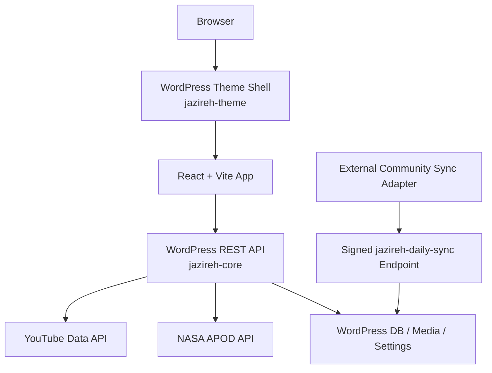

# Project Architecture

## Current Runtime Shape

The active application is WordPress-first. React is bundled into the custom theme, and all public data flows through the `jazireh/v1` REST namespace implemented in the `jazireh-core` plugin.

## Source Layout

- `frontend/`: React source, Vite config, brand assets, and frontend build pipeline
- `wordpress/wp-content/themes/jazireh-theme/`: theme shell, SPA routing integration, and tracked build output
- `wordpress/wp-content/plugins/jazireh-core/`: content models, settings, admin surfaces, REST endpoints, and external integrations
- `tools/community-sync/`: external Node-based extraction and ingestion tooling for Jazireh Daily / YouTube Community posts

The repository intentionally excludes WordPress core, the live database, and runtime uploads.

## Frontend Responsibilities

The React app handles:

- public routing
- page rendering
- the interactive public experience for Home, News, Videos, APOD, Sky, Explore, Radar, and Jazireh Daily
- runtime API resolution through `frontend/src/lib/api.js`
- route-based bundle splitting via `React.lazy()`

Logical frontend paths like `/api/news` remain as internal client abstractions, but in runtime they resolve to WordPress REST when `WORDPRESS_API_URL` is available.

## Theme Responsibilities

`jazireh-theme` is responsible for:

- serving the root React shell inside WordPress
- enqueuing the current Vite build from the generated manifest
- exposing runtime configuration through `window.JAZIREH_WP`
- routing SPA paths such as `/news`, `/videos`, `/apod`, `/sky`, `/explore`, `/radar`, and `/jazireh-daily`
- handing admin/login authority back to native WordPress

Tracking the built `dist/` assets inside the theme keeps deployment simple for shared hosting and WordPress-centric environments where rebuilding on the server is not desirable.

## Plugin Responsibilities

`jazireh-core` is responsible for:

- WordPress custom post types and metadata for news, objects, and Jazireh Daily
- site, branding, social, and homepage settings
- newsletter subscription persistence
- custom admin experiences for project content/configuration
- public REST endpoints under `wp-json/jazireh/v1`
- server-side NASA APOD integration
- server-side YouTube latest-video integration
- signed Jazireh Daily ingestion and media persistence

## External Integration Boundaries

### NASA APOD

- fetched server-side from WordPress
- uses a rolling date range ending on the current day
- cached in transients for six hours
- sorted newest to oldest before being returned to React

### YouTube latest videos

- uses the official YouTube Data API server-side
- resolves the channel uploads playlist, then fetches candidate playlist items, then normalizes filtered video details
- excludes live/upcoming streams and short-form vertical items from the public latest-videos experience
- keeps both a fresh cache and a last-known-good cache

### Jazireh Daily / YouTube Community

This flow is intentionally separate from public page requests:

1. an external Node adapter extracts Community content
2. the adapter signs the payload with HMAC
3. WordPress validates timestamp and replay state
4. WordPress stores posts and media locally
5. React reads the stabilized WordPress content through REST

This design avoids placing brittle extraction logic inside the public PHP request path and gives the site a durable content layer even if upstream Community markup changes later.

## Data Model

The active product state lives in WordPress:

- news posts and categories
- authored celestial objects
- Jazireh Daily posts
- newsletter subscribers
- site settings and menus
- uploaded and synchronized media

There is no active standalone legacy backend in the current runtime architecture.

## Build and Sync Flow

1. Edit React source under `frontend/src`
2. Run `npm run build`
3. Run `npm run build:wordpress`
4. Deploy or sync the custom theme and plugin into the target WordPress runtime
5. Keep database content, uploads, and production secrets on the host environment

## Known Boundaries

- Sky currently ships as a static compatibility snapshot rather than a live external weather or observability feed
- Radar is a simulation, not live scientific telemetry
- Explore uses curated educational content instead of live astronomy catalog feeds
- automatic new Jazireh Daily ingestion depends on the external sync adapter being scheduled outside WordPress
